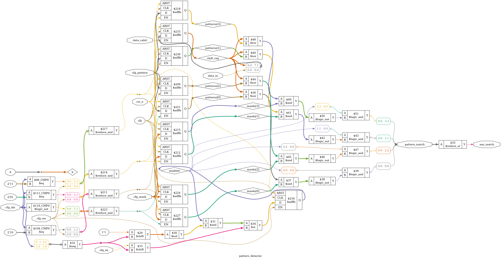
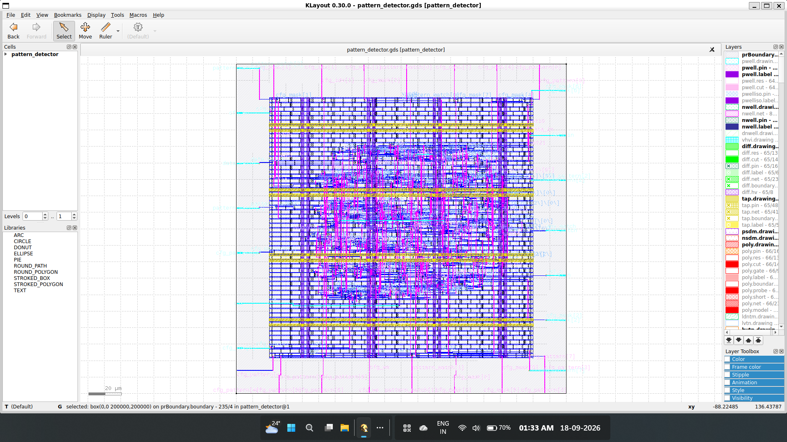
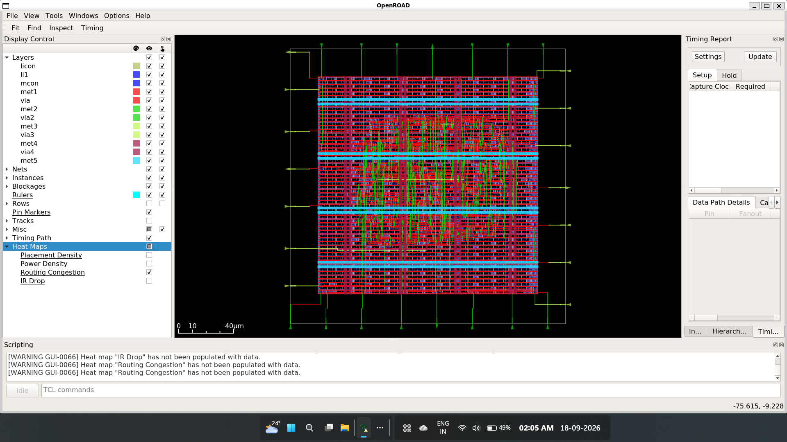
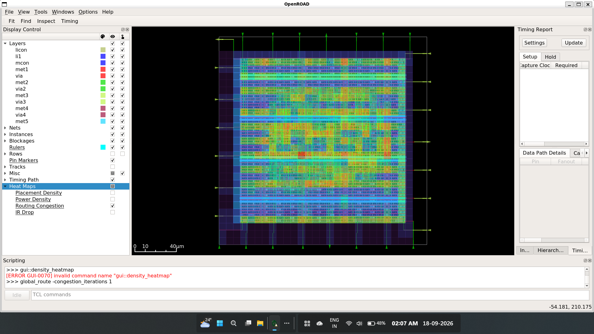
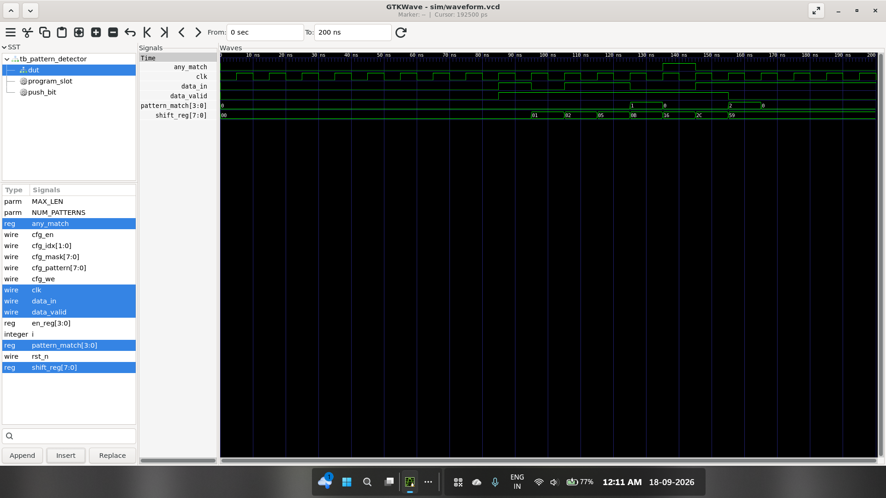

# Programmable Multi-Pattern Detector ASIC (Sky130)

An 8-bit programmable, multi-slot streaming pattern detector ASIC hardened using the **SkyWater 130nm (`sky130A`)** PDK and the **OpenLane** physical implementation flow. The architecture provides runtime slot configuration, bitwise masking, and simultaneous pattern detection across parallel execution slots.

---

## Architecture Overview

The system receives a 1-bit streaming input and compares an internal 8-bit sliding history window against up to 4 independently configurable target patterns:

* **Configurable Slots**: 4 independent pattern slots (`NUM_PATTERNS = 4`).
* **Bitwise Mask Support**: Each slot includes an 8-bit mask register (`cfg_mask`) supporting variable-length patterns (e.g., 4-bit, 6-bit) and wildcards.
* **In-Flight Dynamic Programming**: Patterns and masks can be updated dynamically via the configuration bus without resetting or halting active streaming.
* **Deterministic Flags**: Individual one-hot match indicators (`pattern_match[3:0]`) alongside a low-latency global alert (`any_match`).

### Synthesized Gate-Level Schematic


---

## Physical Design Signoff Summary

Hardened using OpenLane targeting the `sky130_fd_sc_hd` standard cell library.

| Metric | Signoff Value | Tool / Method |
| :--- | :--- | :--- |
| **Process Technology** | 130nm SkyWater CMOS (`sky130A`) | OpenLane |
| **Standard Cell Library** | `sky130_fd_sc_hd` | OpenLane Flow |
| **Design Rule Check (DRC)** | **0 Violations Clean** | Magic DRC |
| **Layout vs Schematic (LVS)** | **0 Errors Clean** | Netgen LVS |
| **Setup Slack (Worst Corner)** | **+4.97 ns** (Met) | OpenSTA |
| **Hold Slack (Worst Corner)** | **+0.32 ns** (Met) | OpenSTA |
| **Clock Frequency** | 100 MHz | Static Timing Signoff |

All detailed signoff logs, timing summaries, and reports are preserved under [`reports/signoff/`](./reports/signoff/).

### Silicon Layout & Physical Visuals

| OpenLane Silicon GDSII Layout | OpenROAD Floorplan View |
| :---: | :---: |
|  |  |

| Detailed Routing Congestion Map |
| :---: |
|  |

---

## Verification & Simulation Waveforms

Automated testing is executed via GitHub Actions on every push:

1. **RTL Functional Regression**: Validates serial bit shifting, multi-pattern detection, and global match assertion.
2. **In-Flight Reconfiguration**: Confirms internal target registers reprogram cleanly mid-stream without resetting shift history.
3. **Prefix Collision Discrimination**: Tests overlapping prefixes (e.g., `1111` vs `1110`) to confirm parallel comparator isolation.
4. **Gate-Level Simulation (GLS)**: Post-synthesis functional verification against Sky130 standard cell primitives.

### GTKWave RTL Waveform Execution


---

## Repository Structure

```text
├── .github/workflows/         # Automated CI/CD pipelines (RTL & GLS)
├── assets/                    # Layout, schematic, and waveform images
├── openlane/pattern_detector/
│   ├── config.json            # OpenLane physical hardening configuration
│   ├── pin_order.cfg
│   └── runs/hardening_run/results/final/
│       ├── gds/ def/ lef/ lib/ sdc/ spef/ sdf/   # Signoff deliverables (multicorner)
│       └── verilog/gl/        # Post-synthesis & post-layout gate-level netlists
├── reports/signoff/           # DRC, LVS, and timing signoff reports
├── rtl/                       # Verilog synthesizable RTL
├── sim/models/                # Sky130 cell/primitive models for GLS
├── tb/                        # Testbench suite covering edge cases & reconfig
├── toolchain_env.txt          # Tool versions and commit hashes
└── LICENSE                    # Apache 2.0 License
```

